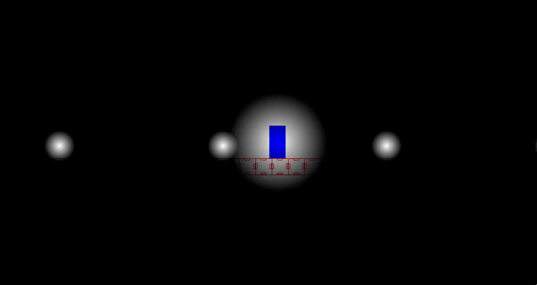
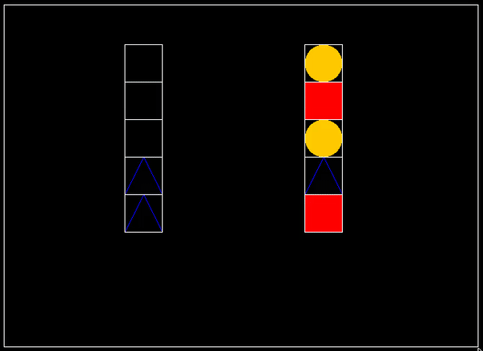

# Simple Java Game System

**Author - Mitch Weaver 2016**

*NOTE:* SJGS development has been discontinued since 2016

-------------------------------------------------------------------------------

Physics Demonstration:

Lighting Demonstration:

Inventory Demonstration:

--------------------------------------------------------------------------------------

## *What is SJGS and why should I use it?*

> SJGS is meant to provide all the functionality that any starting 2D
 developer would need for creating games, while remaining as simple and
 easy-to-use as possible. SJGS offers customizeable levels of
 configuration for almost all elements in the engine to cater to
 beginners and advanced users alike, giving SJGS a much smaller
 learning curve compared to more complex game engines.  
 SJGS is also more than just a physics engine, implementing everything
 from media loading and management, physics, input, game loops, window
 systems, tile map support, world handling, multiple language support,
 a quad-tree data structure, and more.

## *What are its components and dependencies?*

> SJGS is written in both Java and Jython, which means it will require the standalone Jython .jar to function. You will need to include this .jar along with SJGS's .jar in your project's build path in order to use SJGS.
